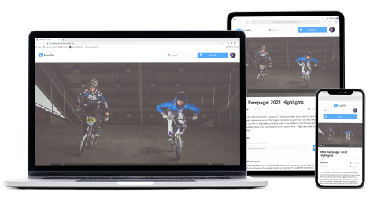

<p align="left
"></p>

## About

[Academic Project] - A mock SPA (single page application) site for streaming videos. Demonstrating proficiency in React, React-Router, Node, Express, API's as well as other front-end essentials. This project was completed in three weeks. 

## Goals and Requirements

My goal was to build a full stack single page application from the ground up. To accomplish this goal I used React, Express, and Node.js. For the styling, we were provided with a mock-up. I was expected to recreate a responsive app according to its specifications.

## Key Learnings

- Fully understood and implemented React fundamentals, including component lifecyle methods, using props and state as well as JSX.
- Utilized React-Router for declarative routing.
- Implemented the basics of Node.js and Express, created API endpoints in order to receive and return data.
- Used Semantic HTML, BEM methodoloy.
- Flexbox, SAAS, responsive and mobile-first design.
- Axios

## Installation

### Clone

- Clone this repo to your local machine using `git@github.com:CharanpreetChall/charanpreet-chall-brainflix-api.git`

### Setup

 **1.** Navigate to the server folder in your terminal and install npm like this:

```
$ npm install
```

 **2.** Setup frontend:

go to [brainstation-brainflix-api](https://github.com/CharanpreetChall/charanpreet-chall-brainflix) repo


*__Make sure to install npm in both the client and server folder__*


 **3.** Navigate to the client folder in your terminal and install npm like this:

```
$ npm install
```

 **4.** Navigate to the server folder run the following:

```
$npm start
```




<h6 align="Center">*Open project and resize browser to see responsiveness across mobile, tablet and desktop settings*</h6>
